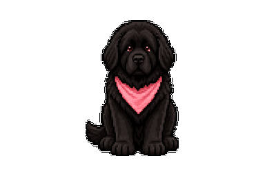
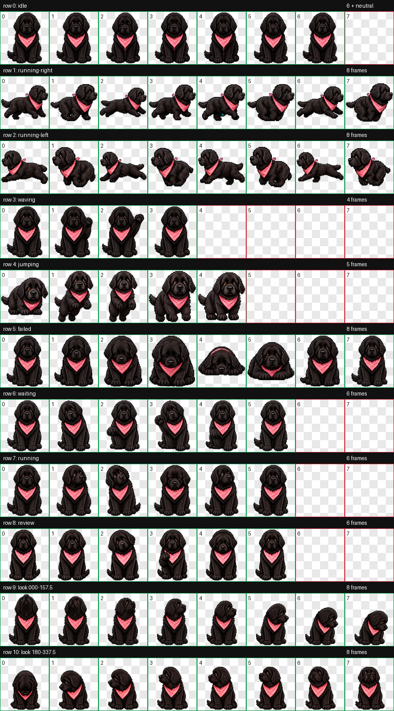
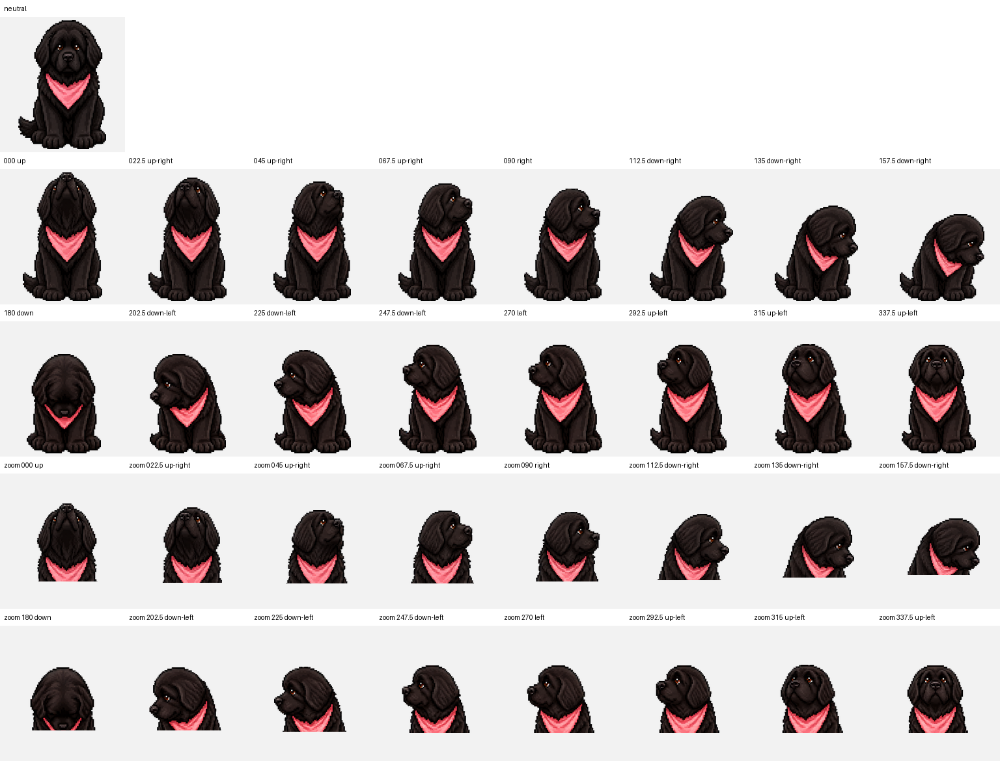

<div align="center">

# Mila

**A little Newfoundland. A loyal coding companion.**

Pixel-art black fur, warm brown eyes, and a signature pink bandana.



Custom Codex pet · Sprite format v2 · 9 animation states · 16 look directions

</div>

## Meet Mila

Mila is a custom animated pet for the Codex desktop app. This repository contains her ready-to-install assets, visual previews, and a practical guide to creating a pet with the same animation structure.

The installable package is just two files. No build step, package manager, or API key is needed to copy the finished assets.

## Install

These file-placement instructions follow the existing local Mila installation and the local hatch-pet packaging contract. Availability and pet-selection controls depend on your Codex desktop version; installation has not been retested on a clean machine.

1. Download this repository using **Code → Download ZIP** and extract it.
2. Locate your Codex home directory: normally `.codex` inside your user home, or the directory specified by `CODEX_HOME` if customized.
3. Inside it, create `pets` if needed, then copy this repository's entire `mila` folder into it. Back up any existing `pets/mila` folder first.
4. Reopen Codex if the pet is not detected, then choose Mila using the pet controls available in your app version.

Expected layout:

```text
<Codex home>/
└── pets/
    └── mila/
        ├── pet.json
        └── spritesheet.webp
```

On Windows, the default parent directory is `%USERPROFILE%\.codex\pets`. On macOS, the equivalent default path is `~/.codex/pets`; that platform has not been tested for this package.

To uninstall, close Codex and remove only the `mila` folder you installed.

## Animations

| State                | Purpose                              |
| -------------------- | ------------------------------------ |
| Idle                 | Quiet companionship between actions  |
| Running right / left | Directional movement                 |
| Waving               | A friendly greeting                  |
| Jumping              | A playful hop                        |
| Failed               | A reaction when something goes wrong |
| Waiting              | An expectant request for attention   |
| Running              | Focused task work                    |
| Review               | A concentrated review pose           |

The final two atlas rows add 16 clockwise look directions, starting with up and advancing in 22.5° steps.

<details>
<summary>View the animation contact sheet and look directions</summary>





</details>

## Make your own pet

Start with the [creation guide](docs/CREATING-A-PET.md), then use the [sprite specification](docs/SPRITE-SPEC.md) to check the package layout. The guide documents a workflow; this repository does not bundle an image generator or the external hatch-pet tooling. Generating new art is nondeterministic and will not recreate Mila byte for byte.

## Repository guide

| Path                                        | Contents                                                 |
| ------------------------------------------- | -------------------------------------------------------- |
| `mila/`                                     | Installable manifest and transparent WebP atlas          |
| `docs/assets/`                              | Existing animation showcase and visual references        |
| [Creation guide](docs/CREATING-A-PET.md)    | Character design, animation workflow, and quality checks |
| [Sprite specification](docs/SPRITE-SPEC.md) | Manifest fields and atlas geometry                       |
| [Contributing](CONTRIBUTING.md)             | How to propose and verify improvements                   |
| [Changelog](CHANGELOG.md)                   | Changes prepared for release                             |
| [Release checklist](docs/RELEASING.md)      | Repository setup and publishing steps                    |
| [Credits and licensing](CREDITS.md)         | Attribution and current licensing status                 |

## Troubleshooting

- **Mila does not appear:** Check for an extra nested folder after extracting the ZIP. `pet.json` must be directly inside `pets/mila/` beside `spritesheet.webp`.
- **The sprite is rejected or looks sliced:** Keep the supplied manifest and atlas together. Do not resize the atlas or remove `spriteVersionNumber: 2`.
- **Your app has no pet controls:** Check your installed app's available features. This package does not add the pet feature itself.
- **Still stuck:** Open an issue with your operating system, Codex version, expected behavior, and a cropped screenshot without private chat content.

## Credits and license

Mila is an independent custom-pet project and is not affiliated with or endorsed by OpenAI. See [CREDITS.md](CREDITS.md). A redistribution license has not yet been selected; see [LICENSING.md](LICENSING.md) before reusing or distributing the assets.
